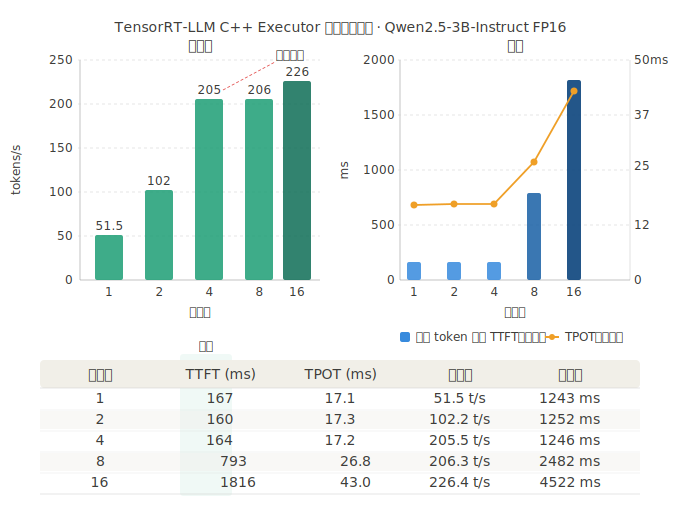

# TensorRT-LLM C++ Executor 推理 Demo

基于 TensorRT-LLM C++ Executor API 实现的 LLM 推理 demo，覆盖模型下载、引擎构建、tokenizer 集成到批量性能基准的完整流程。

**环境：** RTX 5060 Ti · CUDA 13.0 · TensorRT-LLM 1.2.0rc6 · Qwen2.5-3B-Instruct FP16

---

## 快速开始

### 1. 进入容器

```bash
bash step_0_run_docker.sh
```

### 2. 下载模型

```bash
bash step_1_download_model.sh
```

### 3. 转换 checkpoint

```bash
bash step_2_transport.sh
```

### 4. 构建 TensorRT Engine

```bash
bash step_3_build_engine.sh
```

### 5. 验证 Engine

```bash
bash step_4_verify_engine.sh
```

### 6. 检查运行环境

```bash
bash step_7_check_runtime.sh
```

---

## 编译

### 安装 tokenizer 子模块

```bash
git submodule update --init --recursive
```

### 安装 Rust（使用国内镜像）

```bash
export RUSTUP_DIST_SERVER=https://mirrors.ustc.edu.cn/rust-static
export RUSTUP_UPDATE_ROOT=https://mirrors.ustc.edu.cn/rust-static/rustup
curl --proto '=https' --tlsv1.2 -sSf https://sh.rustup.rs | sh
source ~/.cargo/env
```

### 编译 tokenizers-cpp

```bash
cd /workspace/third_party/tokenizers-cpp
mkdir -p build && cd build
cmake .. -DCMAKE_BUILD_TYPE=Release
make -j$(nproc)
```

### 编译推理程序

```bash
cd /workspace
mkdir -p build && cd build
cmake ..
make -j$(nproc)
```

---

## 运行

```bash
# 单条推理
./infer ../engines/qwen25_3b_fp16 1

# 批量推理（batch_size = 4）
./infer ../engines/qwen25_3b_fp16 4
```

---

## 推理性能基准

测试设备：RTX 5060 Ti · Qwen2.5-3B-Instruct FP16 · max_new_tokens=64



| 批大小 | TTFT (ms) | TPOT (ms) | 吞吐量 (tokens/s) | 总耗时 |
|-------:|----------:|----------:|------------------:|-------:|
| 1      | 167       | 17.1      | 51.5              | 1243ms |
| 2      | 160       | 17.3      | 102.2             | 1252ms |
| 4      | 164       | 17.2      | 205.5             | 1246ms |
| 8      | 793       | 26.8      | 206.3             | 2482ms |
| 16     | 1816      | 43.0      | 226.4             | 4522ms |

**结论：** batch=4 是该显卡的最优工作点。batch 1→4 吞吐近似线性扩展（4×），TTFT 和 TPOT 几乎不变；batch 超过 4 后 GPU 打满，吞吐不再增长，TTFT 从 164ms 暴涨至 793ms。
